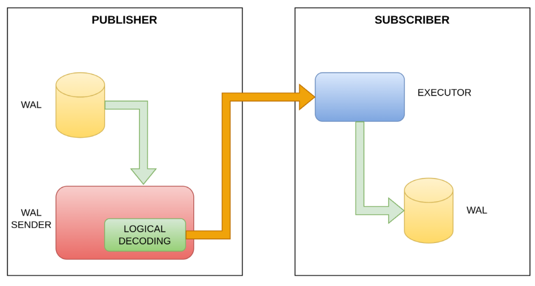

# Logical Replication

> Logical replication is a method that we use to replicate data based on the concept of identity replication.

> REPLICA IDENTITY is a parameter present in table management commands (such as CREATE TABLE and ALTER TABLE); this parameter is used by PostgreSQL to obtain additional information within WAL segments, to recognize which tuples have been eliminated and which tuples have been updated.
>

The `REPLICA IDENTITY` parameter can take four values -

- DEFAULT
- USING INDEX **index_name**
- FULL
- NOTHING

In logical replication, we will take the commands to be sent to the replica server within the WAL segments.
These WAL segments, after being processed through a logical decoding process that reverses the physical information in a logical information, are made available through a publication mechanism.

The primary will then start a publication process, and replica will start a subscription process that, by connecting to the primary's publication, is able to pass the decoded instructions directly to the query executor on the replica machine.



# Logical Replication Servers
```
Publisher -> pg-pub 192.168.100.45
Subscriber -> pg-sub 192.168.200.45

```

# Logical Replication Environment Settings

## Create replication role on both pg-pub and pg-sub
```
create role replication with login replication encrypted password 'LearnPostgreSQL';
```

## Modify postgresql.conf & pg_hba.conf on pub and sub

### Create $PGDATA/conf.d/dba.conf
```
# Check if include_dir = 'conf.d' is enabled
sudo tail -n 20 /etc/postgresql/16/main/postgresql.conf

# Create dba.conf
nano /etc/postgresql/16/main/conf.d/dba.conf
```

#### Add following content in dba.conf
```
# useful on publisher side
listen_addresses = '*'
wal_level = logical
max_wal_senders = 10
max_replication_slots = 10

# useful on subscriber side
max_logical_replication_workers = 4
max_worker_processes = 10

```

### Edit $PGDATA/pg_hba.conf
```
# Edit dba.conf
nano /etc/postgresql/16/main/pg_hba.conf
```

#### Add following content in pg_hba.conf
```
# IPv4 local connections
host all all 127.0.0.1/32 md5
host all replication 192.168.0.0/16 md5
```

## Restart postgresql service
```
sudo systemctl restart postgresql@16-main.service
```

### Verify if postgres is listening on port 5432
```
netstat -an | grep 5432
sudo ss -tulnp | grep 5432
sudo lsof -i :5432
nc -zv localhost 5432
```

# DDL for Logical Replication Setup

## DDLs On Publisher
```
# create db
create database db_source;

# connect to db
\c db_source

# create table
create table t1 (id integer not null primary key, name varchar(64));

# grant access to replication role
grant usage on schema public to replication;
grant select on public.users to replication;

grant select on all tables in schema public to replication;

# create publication for existing tables
create publication all_tables_pub for all tables;
```

## DDLs On Subscriber

```
# create db
create database db_destination;

# connect to db
\c db_destination

# re-create table similar to publisher
create table t1 (id integer not null primary key, name varchar(64));

# create subscription
create subscription sub_all_tables connection 'user=replication password=LearnPostgreSQL host=pg-pub port=5432 dbname=db_source' publication all_tables_pub;
```

# Testing with Data

## Write data on Publisher
```
\c db_source

insert into t1 values (1, 'Linux'), (2, 'FreeBSD');
```

## Read data on Subscriber
```
\c db_destination

select * from t1;
```